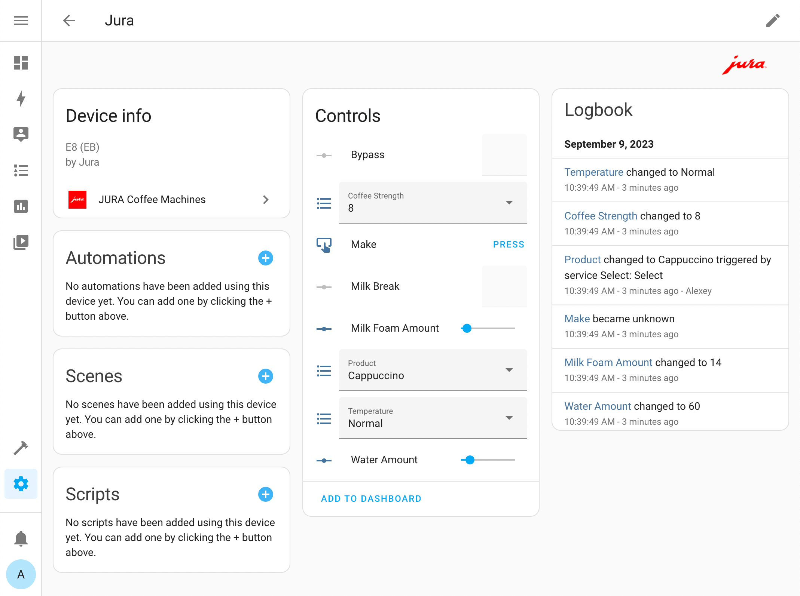

# Jura Coffee Machines for Home Assistant

[Home Assistant](https://www.home-assistant.io/) custom component for control [Jura Coffee Machines](https://us.jura.com/) via [Bluetooth module](https://us.jura.com/en/homeproducts/accessories/SmartConnect-Main-72167).

Tested with the following coffee machines, but should support others: 

- [Jura E6](https://github.com/AlexxIT/Jura/issues/13)
- [Jura E8](https://us.jura.com/en/homeproducts/machines/E8-Piano-Black-NAA-15400)
- [Jura ENA8](https://us.jura.com/en/homeproducts/machines/ENA-8-Metropolitan-Black-NA-15281) (with physical buttons)
- [Jura Z8](https://github.com/AlexxIT/Jura/issues/15)



## Installation

[HACS](https://hacs.xyz/) > Integrations > 3 dots (upper top corner) > Custom repositories > URL: `AlexxIT/Jura`, Category: Integration > Add > wait > Jura > Install

Or manually copy `jura` folder from [latest release](https://github.com/AlexxIT/Jura/releases/latest) to `/config/custom_components` folder.

## Configuration

1. Add default [Bluetooth](https://www.home-assistant.io/integrations/bluetooth/) integration. 

2. Configuration > [Integrations](https://my.home-assistant.io/redirect/integrations/) > Add Integration > [JURA Coffee Machines](https://my.home-assistant.io/redirect/config_flow_start/?domain=jura)

*If you have no MAC address in the setup window, then your HA server can't currently discover any coffee machine nearby. Check that the machine is on, bluetooth is working correctly (can you connect using the JURA smartphone application) and close enough.*

If the machine is discovered but the device is not added, please check that you don't have protected the machine with a PIN code. PIN codes are not currently supported.

## Demo

Video with Yandex voice assistant (Alice) and english subtitles:

[](https://www.youtube.com/watch?v=NzvDjmDLbJE)

## Bluetooth

It is highly recommended to have a good bluetooth adapter. Check list [here](https://www.home-assistant.io/integrations/bluetooth/).

For example, I had unstable control with **five** different adapters (*Unbranded CSR clone detected*):

```
# dmesg | grep Bluetooth
[ 1285.821799] Bluetooth: hci0: CSR: Setting up dongle with HCI ver=9 rev=0001; LMP ver=9 subver=0001; manufacturer=2279
[ 1285.821832] Bluetooth: hci0: CSR: Unbranded CSR clone detected; adding workarounds and force-suspending once...
[ 1285.821846] Bluetooth: hci0: CSR: Couldn't suspend the device for our Barrot 8041a02 receive-issue workaround
```

It was only the sixth adapter with the `CSR8510A10` chip that fixed the situation.

It is also possible to use a [Bluetooth Proxy](https://esphome.io/components/bluetooth_proxy.html) with [active](https://esphome.io/components/bluetooth_proxy.html#configuration) mode supported.

Currently tested with an M5Stack Atom Lite device.

## Wi-Fi

I have NO plans to support a [Wi-Fi module](https://us.jura.com/en/homeproducts/accessories/WiFi-Connect-24160). This requires the purchase of such a module, researching the protocol and write new code. Do all those things that have already been done with the Bluetooth module. And maybe even a lot more work. Without any sense and hope of success.

If you want support for your coffee machine and can't find a working solution, just buy a Bluetooth module.

## Useful links

- https://lunarius.fe80.eu/blog/tag/bluetooth.html
- https://github.com/Jutta-Proto/protocol-cpp
- https://github.com/Jutta-Proto/protocol-bt-cpp
- https://github.com/franfrancisco9/Jura-Python-BT
